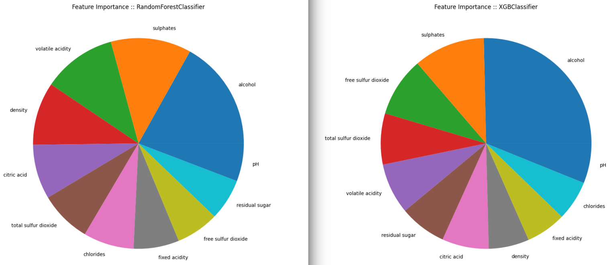
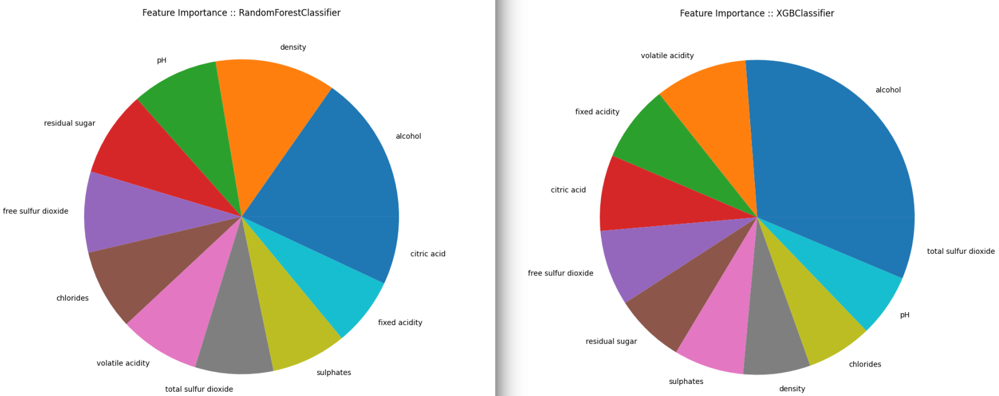

# SciKit Wine Quality

Predicting Wine Quality with Several Classification Techniques using SciKit Learn.

> Based on [Red Wine Quality](https://www.kaggle.com/datasets/uciml/red-wine-quality-cortez-et-al-2009), _Simple and clean practice dataset for regression or classification modelling_

> __Source__: The two datasets are related to red and white variants of the Portuguese [Vinho Verde](http://www.vinhoverde.pt/en/) wine. For more details, consult the reference [Cortez et al., 2009](https://archive.ics.uci.edu/ml/datasets/wine+quality). Due to privacy and logistic issues, only physicochemical (inputs) and sensory (the output) variables are available (e.g. there is no data about grape types, wine brand, wine selling price, etc.). 

## Feature Importance

### Red Wines

### White Wines

